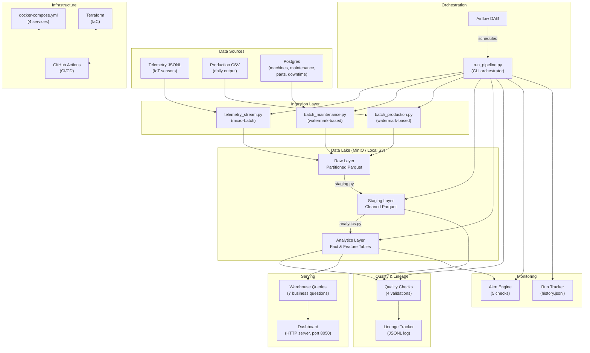

# Architecture Diagram

## Component Summary

| Component | Purpose | Technology |
|-----------|---------|------------|
| Ingestion | Ingest raw data from 3 sources | Python, PyArrow |
| Data Lake | 3-layer storage (raw/staging/analytics) | MinIO (S3-compatible), Parquet |
| Transformations | Clean, normalize, build fact/feature tables | PyArrow |
| Quality | Validate data, track lineage | Custom checks, JSONL log |
| Monitoring | Track runs, fire alerts | JSONL history, threshold checks |
| Warehouse | Answer 7 business questions | PyArrow in-memory queries |
| Dashboard | Visual summary of KPIs | Python HTTP server, HTML/CSS |
| Orchestration | Schedule and run pipeline stages | Airflow DAG, CLI |
| Infrastructure | Container deployment, IaC | Docker, Terraform, GitHub Actions |
